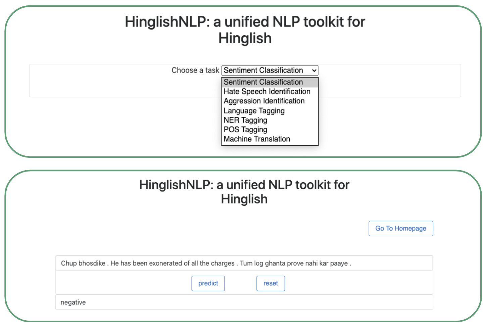
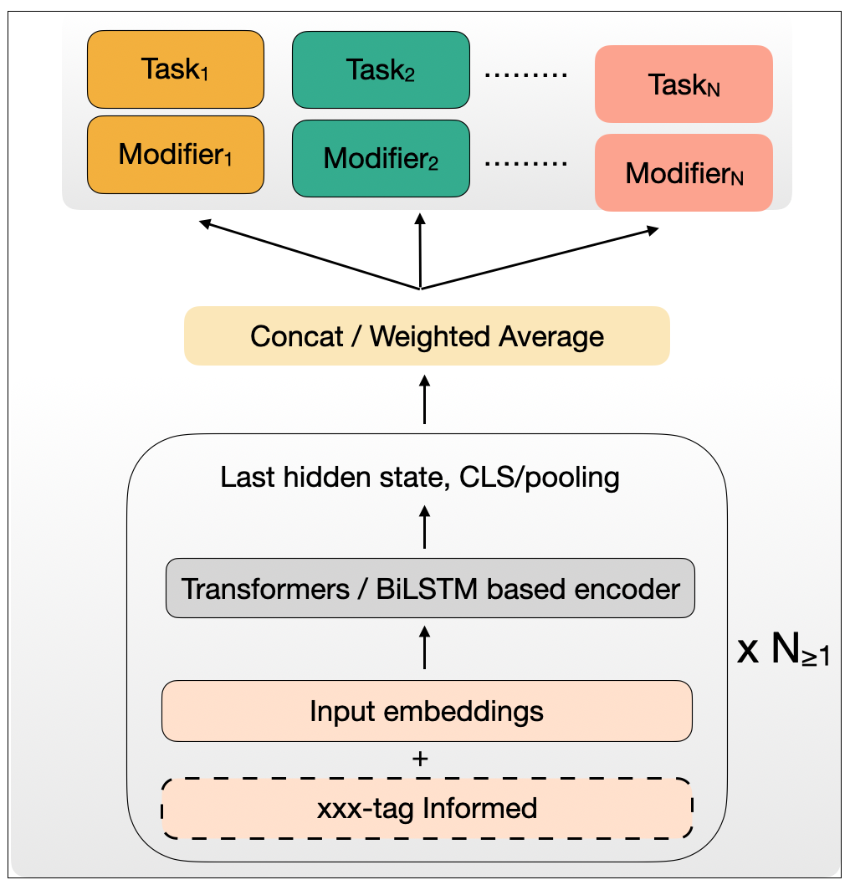

# CodemixedNLP: <br/>An Extensible and Open Toolkit for Code-Switched NLP

- [Installation](#Installation)
- [Quick-start](#Quick-start)
  - [Command line interface](#cli)
  - [Web interface through flask server (Local)](#Web-interface)
- [Modeling](#Train-test)
  - [Modeling Overview](#Model-architectures-overview)
  - [Pretraining](#Pretraining)
  - [Training](#Training)
  - [Evaluation](#Evaluation)
  - [Interactive Usage](#Interactive-Usage)
  - [Dataset standardization](#Dataset-standardization)
- [Data Augmentation](#Data-Augmentation)
- Extras
  - [Installation-Extras](#Extras)
  - [Download datasets](#Download-datasets)

# Installation
```
git clone https://github.com/murali1996/CodemixedNLP
cd CodemixedNLP
pip install .
```
For using transliteration, install extras as mentioned in [Installation-Extras](#Extras)


# Quick-start

### CLI
Downloading pretrained models (based on network connectivity, it might take few minutes to download all models)
```
import CodemixedNLP as csnlp
csnlp.cli.download_sentiment()
csnlp.cli.download_all()
```
Creating models for downstream applications
```
from CodemixedNLP.cli import ModelCreator as HinglishToolkit
myToolkit = HinglishToolkit()
myToolkit.show_available_tasks()
# >>> ['sentiment', 'aggression', 'hatespeech', 'lid', 'pos', 'ner', 'mt']

# Sentiment model
sentiment_classifier = myToolkit.from_pretrained("sentiment")
results = sentiment_classifier.get_predictions(["anyways, wo team kaafi acha hei, not all days are yours",
                                                "anyways, wo team itna acha na laga"])
print(results)

# Aggression Identification Model
aggression_classifier = myToolkit.from_pretrained("aggression")
results = aggression_classifier.get_predictions(["anyways, wo team kaafi acha hei, not all days are yours",
                                                 "anyways, wo team itna acha na laga, just some days are yours"])
print(results)

# POS tagging
lid_classifier = myToolkit.from_pretrained("lid")
results = lid_classifier.get_predictions(["vaise every blogger apni initial stage par yahi galati karte hi hai ", 
                                          "business kaise start kare india me bitcoin me invest kaise start kare youtube videos se paise kamane ke liye ..."], 
                                          pretify=True)
print(results)

# Machine Translation model
translator = myToolkit.from_pretrained("mt")
results = translator.get_predictions(["anyways, wo team kaafi acha hei, glad to be a part of it"])
print(results)
```

### Web interface
Web Interface (through flask-server, requires [Installation](#Installation))
```
cd flask-server
python app.py
```
<p align="center">
    <br>
    
    <br>
<p>


# Train-test

### Model architectures overview

The various customizable components are presented here:
<p align="center">
    <br>
    
    <br>
<p>

```
TODO: Add input attrs table here
```

### Pretraining 
##### (1) MLM Pretraining (Masked Langauge Modeling)
Task-adaptive or Domain adaptive pretraining for (huggingface's) transformer models
```
import CodemixedNLP as csnlp

dataset_folder = "./CodemixedNLP/datasets/dummysail2017"
csnlp.datasets.create_data_for_adaptation([dataset_folder], dest_folder=f"{dataset_folder}/adaptation")
csnlp.benchmarks.run_adaptation(model_name_or_path="xlm-roberta-base", data_folder=f"{dataset_folder}/adaptation")
```
By default, the adapted model is saved at `<inputted data_folder>/models/<model_name>` (e.g `./CodemixedNLP/datasets/dummysail2017/adaptation/models/xlm-roberta-base`)
In case you wish to do domain-adaptive pretraining first and then task-adaptive pretraining in continuation, 
do former using snippet above and then follow: 
```
dataset_folder = "./CodemixedNLP/datasets/dummysail2017"
csnlp.benchmarks.run_adaptation(model_name_or_path=f"{dataset_folder}/domain_adaptation/models/xlm-roberta-base", 
                                data_folder=f"{dataset_folder}/adaptation",
                                save_folder=f"{dataset_folder}/domain_and_task_adaptation/models/xlm-roberta-base")
```
##### (2) CSLM Pretraining (Code Switched Langauge Modeling)
```
Coming Soon ...
```

### Training

- Simple command to train a BERT-based model:
```python
import CodemixedNLP as csnlp
dataset_folder = "./CodemixedNLP/datasets/dummysail2017/Hinglish"

pretrained_name_or_path = "xlm-roberta-base"
csnlp.benchmarks.run_unified(
    dataset_folder=dataset_folder,
    encoders="bert",
    encoder_attributes={"pretrained_name_or_path": pretrained_name_or_path},
    task_attributes={"name": "classification"},
    target_label_fields="label",
    mode=["train", "test"],
    max_epochs=5)
```
If a domain-adapted or task-adapted model is available, just replace the `pretrained_name_or_path` 
value to the checkpointed path (eg. `pretrained_name_or_path = "...adaptation/models/xlm-roberta-base"`)
An example of unifies pretraining and finetuning:
```python
import CodemixedNLP as csnlp
dataset_folder = "./CodemixedNLP/datasets/dummysail2017/Hinglish"

pretrained_name_or_path = "bert-base-multilingual-cased"
csnlp.datasets.create_data_for_adaptation([dataset_folder], dest_folder=f"{dataset_folder}/adaptation")
csnlp.benchmarks.run_adaptation(model_name_or_path=pretrained_name_or_path, data_folder=f"{dataset_folder}/adaptation")
csnlp.benchmarks.run_unified(
    dataset_folder=dataset_folder,
    encoders="bert",
    encoder_attributes={"pretrained_name_or_path":  f"{dataset_folder}/adaptation/models/{pretrained_name_or_path}"},
    task_attributes={"name": "classification"},
    target_label_fields="label",
    mode=["train"],
    max_epochs=5)
```

- If you would like to **concat representations** from two BERT-based models, do:
```python
csnlp.benchmarks.run_unified(
    dataset_folder=dataset_folder,
    encoders=["bert", "bert"],
    encoder_attributes=[{"pretrained_name_or_path": "bert-base-multilingual-cased"},
                        {"pretrained_name_or_path": "xlm-roberta-base"}],
    task_attributes={"name": "classification"},
    target_label_fields="label",
    mode=["train", "test"],
    max_epochs=5,
    encodings_merge_type="weighted_ensemble")
```
In this example, we also showcase how once can use a trainable-weight scored ensemble when using multiple encoders.

- If you would like to **fuse representations** from same encoder (eg. fuse information from raw text and transliterated text), do:
```python
csnlp.benchmarks.run_unified(
    dataset_folder=dataset_folder,
    encoders="bert",
    encoder_attributes={"pretrained_name_or_path": pretrained_name_or_path},
    task_attributes={"name": "classification"},
    target_label_fields="label",
    mode=["train", "test"],
    fusion_text_fields=["text", "text_transliterated"])
```

- If you are interested to do **langauge informed modeling** (i.e. pass langauge tags alongside textual inputs), then do:
```python
csnlp.benchmarks.run_unified(
    dataset_folder=dataset_folder,
    encoders="bert",
    encoder_attributes={"pretrained_name_or_path": "./arxiv/xlm-roberta-base"},
    task_attributes={"name": "classification"},
    target_label_fields="label",
    mode=["train", "test"],
    tag_input_label_field=tag_input_label_field)
```
Notably, transformer-based encoders here require a pretrained path (referring by name is not sufficient).
To download models from Huggingface, one can do:
```
cd arxiv
>>> from transformers import AutoModel, AutoTokenizer, AutoConfig
>>> AutoModel.from_pretrained("xlm-roberta-base").save_pretrained("./")
>>> AutoConfig.from_pretrained("xlm-roberta-based").save_pretrained("./")
```

- If you are interested to do **multi-task modeling**, here is an example with text classification and sequence tagging tasks:
```python
csnlp.benchmarks.run_unified(
    dataset_folder=dataset_folder,
    encoders="bert",
    encoder_attributes={"pretrained_name_or_path": "distilbert-base-multilingual-cased"},
    task_attributes=[{"name": "classification"}, {"name": "seq_tagging"}],
    target_label_fields=["label", "langids"],
    mode="train")
```

- If you would like to combine a BERT-based encoding with a BiLSTM encoding based on fasttext embeddings, follow:
```python
csnlp.benchmarks.run_unified(
    dataset_folder=dataset_folder,
    encoders=["bert", "lstm"],
    encoder_attributes=[
        {"pretrained_name_or_path": "xlm-roberta-base"},
        {"input_representation": "fasttext"}],
    task_attributes={"name": "classification"},
    target_label_fields="label",
    mode=["train", "test"],
    encodings_merge_type="concat")
```
This requires additional [FastText](https://fasttext.cc/) dependency. See [Installation-Extras](#Extras).


- For more examples and architectural patterns, see [`tests.py`](./tests.py)


### Evaluation
```
TODO
```

### Interactive Usage
```
TODO
```

### Dataset standardization
Choose your data formatter based on your source data format (eg. CONLL)
```
TODO
```
Alternatively, you can create it on your own leading to jsonline template format below
```
{
	"dataset": "sail2017_hinglish",
	"task": "classification",
	"split_type": "dev",
	"uid": "15016",
	"text": "commentator ( dunno who ) : huge celebrations for the dismissal of suresh kohli # cwc15 # indvspak",
	"langids": "en other en en other other en en en en en en en other other en other en",   # --> if available and required for your task
	"label": "neutral",   # --> if available and required for your task
}
```
with data folder as below
```
<dataset_name>
    ├── train.jsonl
    ├── test.jsonl
    ├── dev.jsonl 
    ├── dev.jsonl 
```
and each file consisting of several jsonlines in the format mentioned above

A long version of jsonline with various types of fields is available in [Appendix](#Appendix)


# Data Augmentation
```
TODO
```


# Download datasets

```
cd datasets
python download_jsonl_datasets.py
```


# Extras
- For setting up a Demo locally
```python
import CodemixedNLP as csnlp
csnlp.extras.install_flask_extras()
```

- For using [Fairseq](https://github.com/pytorch/fairseq) library in CLI:
```bash
pip install importlib_metadata
pip install sacremoses
pip install sentencepiece
pip install fairseq
# git clone https://github.com/pytorch/fairseq
# cd fairseq
# git checkout 5379461e613263911050a860b79accdf4d75fd37
# pip install --editable ./
```

- For transliteration:
```python
import CodemixedNLP as csnlp
csnlp.extras.install_indic_trans()
```
Alternatively, one can also do:
```bash
git clone https://github.com/libindic/indic-trans
cd indic-trans
pip install .
```

- For [fastText](https://github.com/facebookresearch/fastText) usage:
```bash
git clone https://github.com/facebookresearch/fastText
pip install .
```
```python
# mkdir fasttext_models
# cd fasttext_models
import fasttext.util
fasttext.util.download_model('en', if_exists='ignore')
fasttext.util.download_model('hi', if_exists='ignore')
ft = fasttext.load_model('cc.en.300.bin')
```


- For installing character-bert
```
git clone https://github.com/libindic/character-bert
cd character-bert
```


# Appendix
### Long format of a jsonline in our _standardized_ format
```
{
	"dataset": "sail2017_hinglish",
	"task": "classification",
	"split_type": "dev",
	"uid": "15016",
	"text": "commentator ( dunno who ) : huge celebrations for the dismissal of suresh kohli # cwc15 # indvspak",
	"langids": "en other en en other other en en en en en en en other other en other en",
	"label": "neutral",
	"seq_labels": null,
	"text_pp": "commentator ( dunno who ) : huge celebrations for the dismissal of suresh kohli # cwc15 # indvspak",
	"langids_pp": "EN UN EN EN UN UN EN EN EN EN EN EN EN UN UN EN UN EN",
	"meta_data": null,
	"text_trt": "commentator ( dunno who ) : huge celebrations for the dismissal of suresh kohli # cwc15 # indvspak",
	"langids_trt": "en other en en other other en en en en en en en other other en other en",
	"text_hi": "टिप्पणीकार (दुन्नो कौन): सुरेश कोहली की बर्खास्तगी के लिए विशाल समारोह # cwc15 #vvkak",
	"text_en": "commentator ( dunno who ) : huge celebrations for the dismissal of suresh kohli # cwc15 # indvspak",
	"text_D": "कमेंटटर ( दुन्नो वो ) : ह्युज सेलिब्रेशन्स फॉर थे डिस्मिसाल ऑफ सुरेश कोहली # कक15 # इंडव्स्पक",
	"text_non_english": "( ) : kohli # #",
	"text_non_hindi": "commentator ( dunno who ) : huge celebrations for the dismissal of suresh kohli # cwc15 # indvspak",
	"text_non_english_D": "( ) : कोहली # #"
}
```
### Popular Codemixed Datasets
| XXX-English       | LID            | NER            | POS            | SA                        | Agg | HS | Offens | MT |
|-------------------|----------------|----------------|----------------|---------------------------|-----|----|--------|----|
| Hindi-English     | Lince, Gluecos | Lince, Gluecos | Lince, Gluecos | SAIL-2017,  Sentimix-2020 |     |    |        |    |
| Tamil-English     |                |                |                | FIRE-2020                 |     |    |        |    |
| Malayalam-English |                |                |                | FIRE-2020                 |     |    |        |    |
| Bengal-English    |                | ICON-2016      |                |                           |     |    |        |    |
| Telugu-English    |                | ICON-2016      |                |                           |     |    |        |    |
| Nepali-English    | Lince          |                |                |                           |     |    |        |    |
| Spanish-English   | Lince          | Lince          | Lince          | Lince                     |     |    |        |    |
|                   |                |                |                |                           |     |    |        |    |
|                   |                |                |                |                           |     |    |        |    |